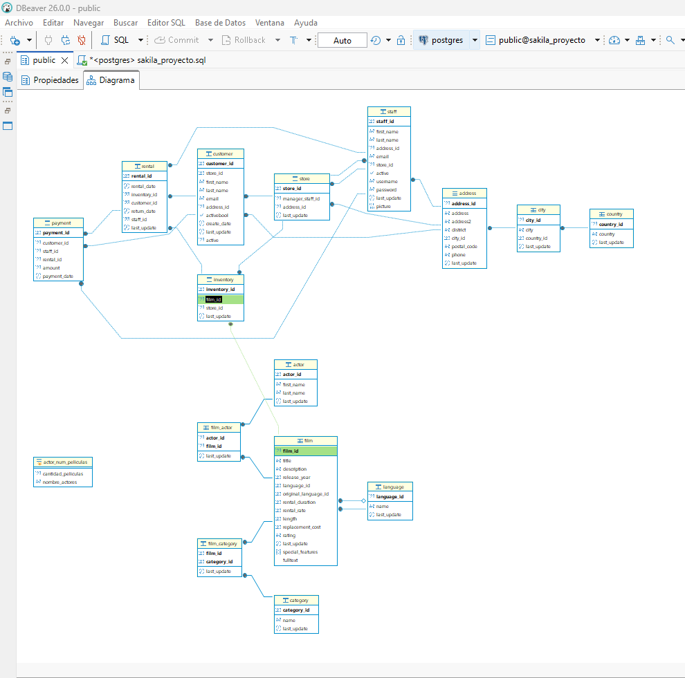

# 🎬 Proyecto SQL: Análisis de la Base de Datos Sakila

Este proyecto consiste en la resolución de **64 ejercicios** utilizando SQL sobre una base de datos de una tienda de alquiler de películas, basada en Sakila.  
El objetivo es aplicar los conocimientos aprendidos en SQL, incluyendo consultas simples, agregaciones, joins, subconsultas, vistas, tablas temporales y buenas prácticas.

---

## 🗂️ Estructura del proyecto

├── BBDD_Proyecto_shakila_sinuser.sql  
├── README.md  
├── diagrama_sql.png  
└── sakila_proyecto_terminado.sql  

- `BBDD_Proyecto_shakila_sinuser.sql`: esquema y datos de la base de datos proporcionada.
- `README.md`: descripción del proyecto, pasos seguidos y conclusiones.
- `diagrama_sql.png`: imagen del diagrama de las relaciones entre las tablas.
- `sakila_proyecto_terminado.sql`: archivo con las consultas resueltas del proyecto.

---

## 🛠️ Instalación y requisitos

Para realizar este proyecto se ha utilizado:

- PostgreSQL
- DBeaver

### Pasos para ejecutar el proyecto

1. Crear una base de datos nueva en PostgreSQL.
2. Importar el archivo `BBDD_Proyecto_shakila_sinuser.sql`.
3. Abrir DBeaver y conectarse a la base de datos.
4. Ejecutar el archivo `sakila_proyecto_terminado.sql` para consultar las soluciones.

---

## 🧭 Pasos seguidos durante el proyecto

1. Revisión de la estructura de la base de datos y sus relaciones.
2. Identificación de las tablas principales y de las tablas puente.
3. Resolución progresiva de las consultas del proyecto.
4. Comprobación de resultados en DBeaver.
5. Aplicación de joins, subconsultas, vistas y tablas temporales en los ejercicios más avanzados.

---

## 📊 Resultados y conclusiones

Durante el proyecto se trabajaron diferentes tipos de consultas SQL, desde filtros y ordenaciones básicas hasta ejercicios más complejos con joins, agregaciones, subconsultas, vistas y tablas temporales.

Los ejercicios permitieron reforzar especialmente:

- el uso de `JOIN` para relacionar tablas,
- el uso de `COUNT`, `SUM`, `AVG`, `MIN` y `MAX`,
- la diferencia entre `WHERE` y `HAVING`,
- el uso de `DISTINCT`,
- el uso de subconsultas para comparar con valores agregados o fechas de referencia,
- el uso de **CTEs** en los ejercicios 61 y 64 como forma de estructurar mejor las consultas y mejorar su legibilidad.

Este proyecto ha servido para comprender mejor la lógica necesaria para traducir enunciados a consultas SQL y reforzar la interpretación de relaciones entre tablas dentro de una base de datos relacional.

---

## 🗺️ Modelo de Datos (Diagrama Entidad-Relación)

Para comprender mejor las relaciones entre las tablas y cómo se han construido las consultas, se incluye el siguiente diagrama:

---

## ✒️ Autora

**Bella Laya** - [bellalaya80-max](https://github.com/bellalaya80-max)
